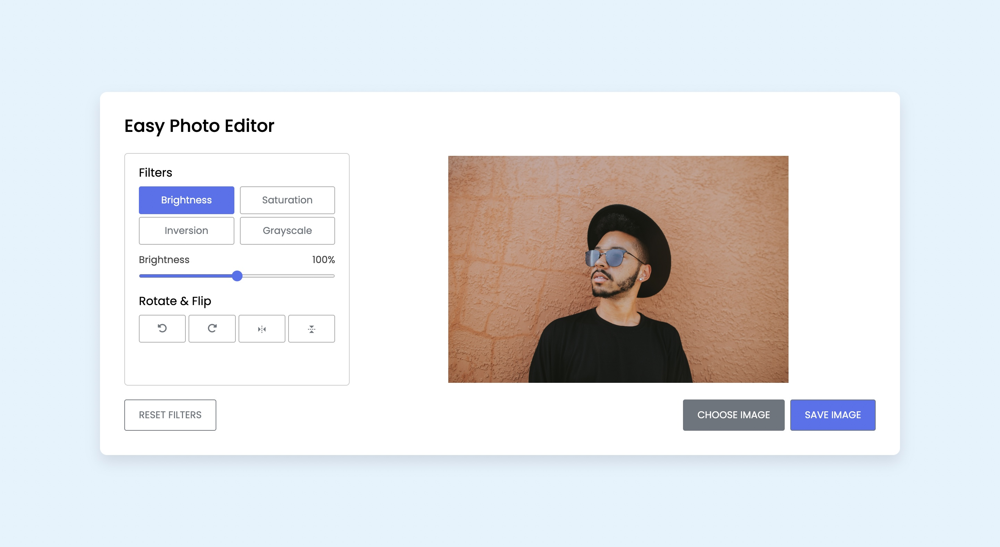

# Photo-Editor

This is a project I built by following the [Tutorial by CodingNepal](https://youtu.be/YqUUvBpCtfA). 

## Table of contents

- [Overview](#overview)
  - [Screenshot](#screenshot)
  - [Links](#links)
- [My process](#my-process)
  - [Built with](#built-with)
  - [What I learned](#what-i-learned)
  - [Useful resources](#useful-resources)
  
- [Author](#author)

## Overview

### Screenshot

### Links

- Live Site URL: [Live Site Here](https://storied-valkyrie-821058.netlify.app/)

## My process

### Built with

- JavaScript
- Semantic HTML5 markup
- CSS custom properties
- Flexbox
- CSS Grid

### What I Learned
- CSS filter property
- HTML Canvas

### Useful resources
- [CSS filter property](https://www.w3schools.com/cssref/css3_pr_filter.php) - add filter to image using CSS.
- [HTML Canvas](https://www.freecodecamp.org/news/full-overview-of-the-html-canvas-6354216fba8d/) - how to use HTML canvas with JavaScript.

## Author

- Twitter - [@NotPerry8811](https://www.twitter.com/NotPerry8811)